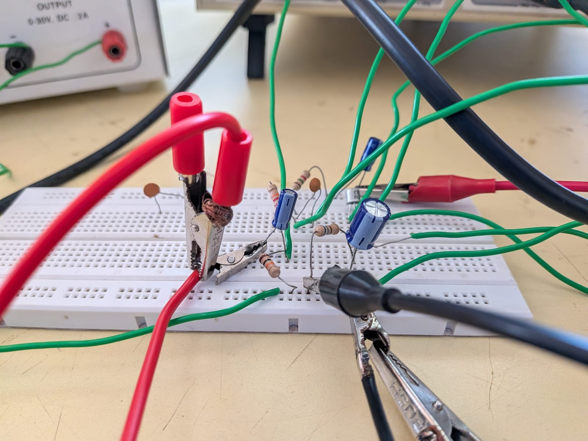

# TRANSISTOR SIGNAL AMPLIFIER & WAVEFORM ANALYSIS USING BC107B

## 📌 Project Overview

This project demonstrates the working principle of a transistor-based signal amplifier using the BC107B transistor. The hardware circuit is designed to amplify an input signal, and the output waveform is observed to understand the amplification process.

## 🎯 Objectives

* To understand the basic working principle of a transistor amplifier.
* To study the operation of the BC107B transistor in an amplifier circuit.
* To observe and analyze the output waveform.
* To understand the relationship between the input signal and the amplified output signal.

## 🔧 Components Used

* BC107B NPN transistor
* Resistors
* Capacitors, if used in the circuit
* Breadboard or circuit assembly
* Connecting wires
* Power supply
* Input signal source
* Oscilloscope or waveform measurement instrument

*Note: The exact components depend on the hardware circuit implemented.*

## ⚙️ Working Principle

The BC107B is an NPN bipolar junction transistor that can be used for signal amplification when appropriately biased in its active region.

A small input signal is applied to the amplifier circuit. The transistor controls a larger current through the circuit, producing an output signal that can have a greater voltage amplitude than the input signal.

The output waveform is observed using a suitable measuring instrument to study the amplifier's behavior.

The actual voltage gain and phase relationship depend on the circuit configuration and component values.

## 🔌 Hardware Circuit

The following image shows the hardware circuit used for the project.

## 📈 Output Waveform

The following image shows the observed output waveform.

## 📊 Results and Conclusion

The hardware project demonstrates the use of a BC107B transistor in a signal amplification circuit. The output waveform provides a visual representation of the circuit's response to the applied input signal.

The project helps develop a practical understanding of transistor operation, signal amplification, and waveform observation.

## 👥 Team Members

* Suhasgowda
* Sukrut
* Praveen
* Akash

## 🛠️ Project Type

Hardware Implementation | Analog Electronics | Transistor Amplification
